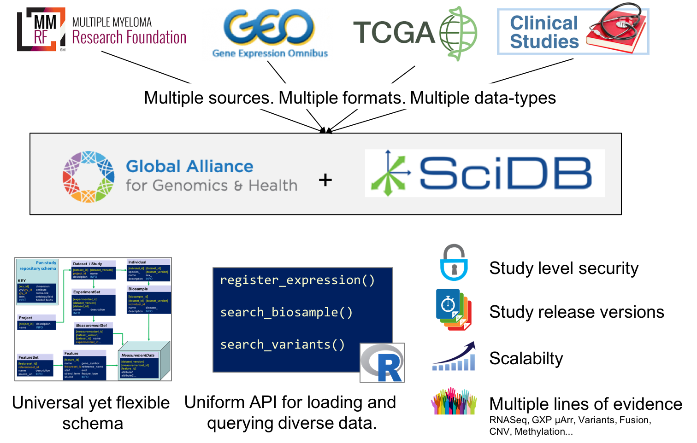

--- 
title: "Insight API for SciDB"
author: "Kriti Sen Sharma (Customer Solutions, Paradigm4 Inc.)"
# date: "`r Sys.Date()`"
site: bookdown::bookdown_site
output: bookdown::gitbook
documentclass: book
bibliography: [book.bib, packages.bib]
biblio-style: apalike
link-citations: yes
github-repo: paradigm4/insight
description: "Documentation for the SciDB Insight API"
---

# Introduction {#intro}

[https://github.com/paradigm4/insight](https://github.com/paradigm4/insight)

```{r insight-api-intro, echo=FALSE, fig.cap='Insight API', out.width='80%', fig.asp=.75, fig.align='center'}

```

## What is Insight?

The Insight API leverages the multidimensional array database [SciDB](https://www.paradigm4.com/) to handle:

- multiple data sources
- multiple formats
- multiple data-types

Other features of the API include

- A **universal yet flexible schema** inspired by the recommendations of the GA4GH (global alliance for genomics and health) action group. 
- A **uniform API** for loeading and querying diverse data
- Other industry-standard requirements like
    + **study-level security**
    + ability to store **different release versions**
    + **scalablility** to handle TB-s of data

More details about each of the features are provided below. 

### Multiple data-sources

In Fig. \@ref(fig:insight-api-intro), we show an example genomics data warehouse that combines data from **multiple sources** like

- multiple myeloma research foundation (**MMRF**)
- gene expression omnibus (**GEO**)
- the cancer genome atlas (**TCGA**)
- data from clinical studies private to a pharma company

### Multiple formats

All the data-sources above release their data in custom **formats**, and these need to be curated locally before being integrated into SciDB. The Insight API relieves the user of doing this pain-staking work by having already integrating multiple lines of evidence into one coherent easily queriable data-warehouse. 

### Multiple data-types

Supported data-types include

- **phenotype data** (patient information, demographic information)
- **variant data** (e.g. short nucleotide variants / SNV, structural variants)
- **gene-expression data** (from RNASeq or gene-expression by microArray experiments)
- **copy number variant data**
- **fusion data**

Support for more data-types is continuously being added. 

```{r include=FALSE}
# automatically create a bib database for R packages
knitr::write_bib(c(
  .packages(), 'bookdown', 'knitr', 'rmarkdown'
), 'packages.bib')
```
